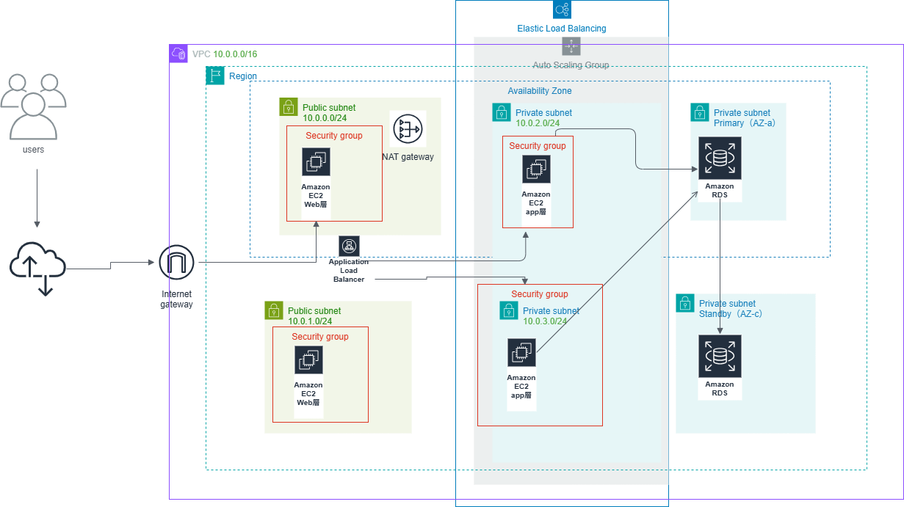

# AWS 3-Tier Architecture (Multi-AZ)

本プロジェクトは、AWS 上に構築する **複数AZ対応の Web 3層アーキテクチャ** を  
Terraform によって IaC 化したものです。

## 使用サービス

- VPC / Subnet / Route Table
- Internet Gateway / NAT Gateway
- ALB（Application Load Balancer）
- Auto Scaling Group（EC2）
- Security Group
- RDS（Multi-AZ + Read Replica）
- IAM Role / Instance Profile
- Terraform（IaC）

## アーキテクチャのポイント

- **複数AZ構成** による高可用性
- **Auto Scaling Group** による自動復旧
- **ALB** による負荷分散
- **RDS Multi-AZ + Read Replica** による冗長化構成  
  ※本アプリでは DB を参照しないが、構成として冗長性を確保
- **Private Subnet に RDS** を配置しセキュアな構成
- **Terraform による完全自動構築**
- ※本プロジェクトは Web ページ表示のみを行うため  
アプリケーションから RDS への読み取りは行っていません。  
しかし、インフラ構成としては本番同等の  
**Multi-AZ + Read Replica の冗長構成** を採用しています。

## アーキテクチャ図

  

